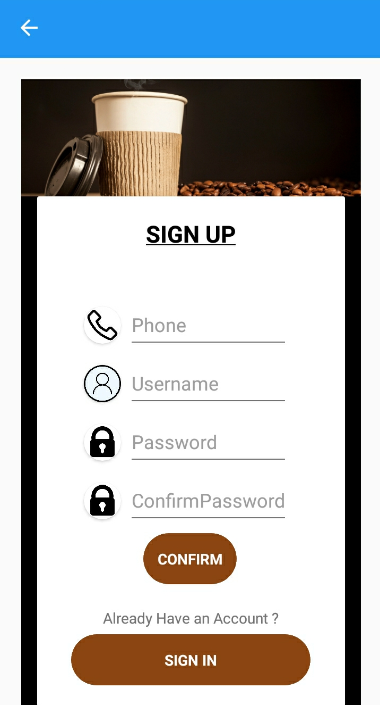
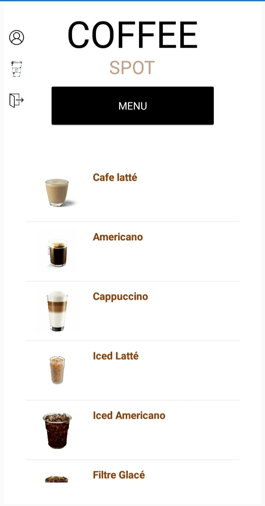
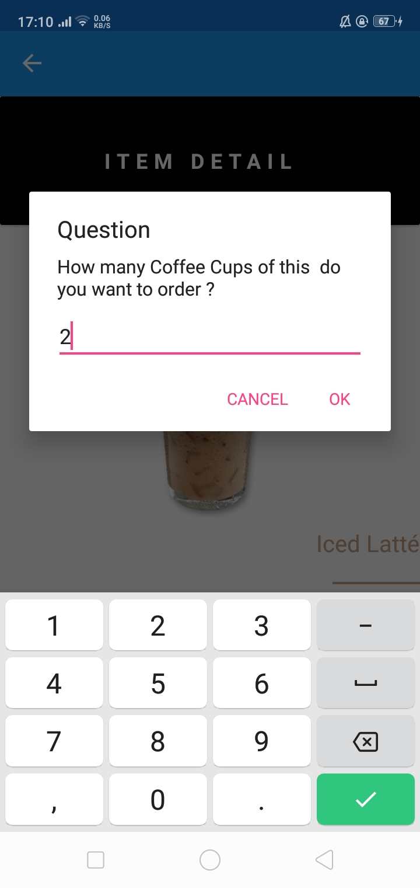

# CoffeeDeliveryApp
A simple cross platfom Coffee Delivery App developed with Xamarin
# Screens 
A simple Xamarin.Forms demo app with seven primary screens:

-  a splashscreen
-  a signin page screen
-  a signup page screen 
-  a home page screen 
-  a read-only detail screen
-  an editable detail screen
-  a user profil page screen 

